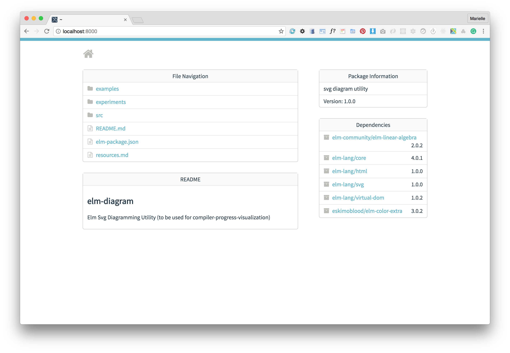

**Elm 0.17**, **shareable** 

## Running programs

To facilitate rapid development, the `Elm Platform` provides a tool that will automatically transpile your Elm code and serve it to your browser. You can access that tool from the command line. Type `elm-reactor` or `elm reactor`. For more information about what the tool does and what options are available, type `elm reactor --h`.

Let's presume that we have a mini elm project with:

File: `experiments/1/Main.elm`
```elm
import Html exposing ( div, text )
import Html.Attributes exposing ( class )

sampleSection : Html
sampleSection =
    div [ class "section" ] [ text "Section 1" ]
```

To rapidly check how it renders, call `elm-reactor`.

```bash
-- make sure you are in the root directory of your project
$ cd experiments/
-- execute
$ elm-reactor
elm reactor 0.17.0
Listening on http://localhost:8000/
-- open the specified url in your browser
$ open "http://localhost:8000"
```



Click on your Elm file in the displayed page to run it.

If any compilation error is displayed or you are not happy with the outcome, edit the code file, save it, and click the refresh button in your browser. The elm file will be transpiled anew. 

If the default url of `http://localhost:8000` conflicts with some other running application, you can specify a different address and port with `elm-reactor -a=localhost -p=4040`


